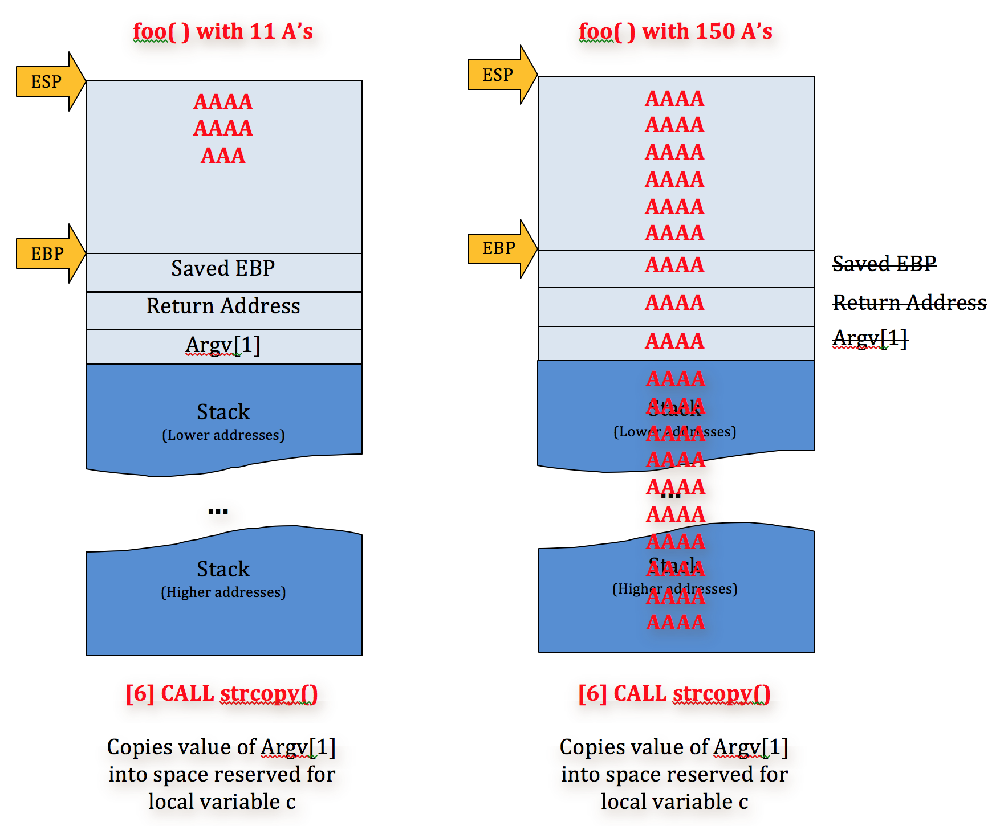

# Copyrights © The ByPassCfg authors.
<html><a href="https://twitter.com/Yena0xC5">@Yena0xC5</a></html>

# description
verius exploitation techniques to attack the intel x86 architecture in order to bypass CFG mechanisms, cause memory corruption & to take over the instruction pointer, over multiple operating systems and cpu platforms and a reverse analysis of the intel processor architecture exploitation, this includes  a windows, linux & an OSx version's. in addition a syscall tables and usfull links are provided in addition to the exploit itself in the bin directorys. all operating system exploits use dynamicd linking technics in order to bypass CFG mechanisms, while The linux exploit can grant privilege acceleration, The windows version do not grant a uac bypass, but instead a CFG bypass and The opportunity to execute any given assembly code without kernel verification.

<table>
    <tr>
        <th>windows section</th>
	<td><a href="https://github.com/kukuriku/ByPassCfg/blob/master/ReWin/README.md">ref</a></td>
    </tr>
    <tr>
        <th>linux section</th>
        <td><a href="https://github.com/kukuriku/ByPassCfg/blob/master/ReUnix/README.md">ref</a></td>
    <tr>
        <th>Mac OSx section</th>
        <td><a href="https://github.com/kukuriku/ByPassCfg/blob/master/ReOSX/README.md">ref</a></td>
     <tr/>
</table>

# Tested on:
# Hardware,
10 core - Intel Xeon E5-2660 v2 @ 2.20GHz <html><a href="https://www.cpubenchmark.net/cpu.php?cpu=Intel+Xeon+E5-2660+v2+%40+2.20GHz">Tech details</a></html> 
HP Pavilion Desktop - 510-p020 Intel® Core™ i5-4460S Processor <html><a href="https://ark.intel.com/products/80818/Intel-Core-i5-4460S-Processor-6M-Cache-up-to-3_40-GHz">Tech details</a></html> 
DELL inspiron-15-3521 <html><a href="http://www.dell.com/en-us/shop/productdetails/inspiron-15-3521">Tech details</a></html>, intel core(TM) i5-3337u <html><a href="https://ark.intel.com/products/72055/Intel-Core-i5-3337U-Processor-3M-Cache-up-to-2_70-GHz">4-core's</a></html> 
Packard bell imedia 53800 intel(R) Core(TM) i3 530 dual core <html><a href="http://ark.intel.com/products/46472/Intel-Core-i3-530-Processor-4M-Cache-2_93-GHz">Tech spec</a></html>

# Operating Systems,

windows  

Windows 10 pro os build 15063.413 
Windows-10-Build-16215.1 RS3 
Windows 8.1, Update 1	6.3.9600  

linux 

debian-8.6.0-amd64-cinnamon 
ubuntu-16.04.1-desktop-amd64 
Ubuntu 16.04.2 LTS (Xenial Xerus)  

Mac OsX  
Mavericks v10.9.5, Darwin 13.4 

# VmWare

Oracle VM VirtualBox 5.1.22 
with and without: Hyper-v & Kvm 
Microsoft <html><a href="https://github.com/kukuriku/ByPassCfg/blob/master/VmWare/HyperV/README.md">Hyper-V</a></html> >> for the time being the only system that did not suffer the payload directly ((a possible fixup)).  

# Tech

# The first method (lena) 

in this  method we abuse the cfg while initializing legit memory reservations, at the start of the program, making the cfg call for the image loaders with good flag assertion parameters. later on the program commits a continuous illegal set of instruction; loading into the small allocated space a much bigger buffer then it allocated. who leads to virtual memory overruns.

the diagram above demonstrates the memory corruption mechanism, while at this stage the program already writes to extend virtual addresses leading to critical components failure, as one can see at this <html><a href="https://github.com/kukuriku/ByPassCfg/blob/master/ReWin/pic/bsod.gif">critical error</a></html>. 
for our source code reffer to <html><a href="https://github.com/kukuriku/ByPassCfg/blob/master/ReOSX/README.md">Executable description</a></html>. but we would have to state that the exact payload is not the main idea here....

# possible fixup: 

while operating this payload under the hyper-v platform, under debien os, the program was killed with an error code, after about 10k round of operation. at this stage, this is the only setup that did the above described operation. as we see it the dynamic memory manager at the hyper-v core architecture (<html><a href="http://bit.ly/2tBrBi8">ref</a></html>) and nested paging

, lives the operating system with enough unreachable resources to allow the ThreadPool to eliminate the program.
if per say the HAL components (<html><a href="https://msdn.microsoft.com/en-us/library/windows/hardware/ff565727(v=vs.85).aspx">ref</a></html>) would implement a more hard memory reservation, then it is possible, that by living a chunk of unreachable memory to the critical operating system components, then this method will be fixed. (by our point of view alone.)

# theory
following <html><a href="https://en.wikipedia.org/wiki/G%C3%B6del%27s_incompleteness_theorems">Gödel's incompleteness theorems</a></html>, who later leads to one of the fundamental problems in computability theory, <html><a href="https://en.wikipedia.org/wiki/Halting_problem">The Halting problem</a></html>, that is the problem of determining, from a description of an arbitrary computer program and an input, whether the program will finish running or continue to run forever. 

in a mathematical form, given a function h(i,x) such as:

it was fairly deduced That there is no total computable function that decides whether an arbitrary program i halts on arbitrary input x; that is, the following function h is not computable.   

meaning that any linker should not be able to properly guard any execution given that it is conducted at an infinite loop. The only chance, at our personal opinion, to stop this crafted payload is to limit the program access to the harware resources, that, as far as we have witness, cannot be completely achieved at the given time. 
as any operating system that we have tested offers multiple backdoors for tubing a direct tunnel to the processor.

# Systems that did not suffer the payload directly:
debien on Hyper-v; required a boost launcher to cause a system crush.
 
# NOTES
  
  while operating the payload on a host machine, one should see an imidiate system failure,
  on windows systems you should ether see a black screen or just a complete system crash.
  
  on a virtual machine:
  it depends on the resources that the system has, the more power you give to the host, the faster it drops.
  
  # on any windows machine:
   This Works With DEP & cfg on.  

# STATUS
# on the 16/6/17 this repo was submitted to;
<table>
    <tr>
        <th>CVE Request 349130 for CVE ID Request</th>
        <td>Status - No answer.</td>
    </tr>
    <tr>
        <th>MSRC Case 39225 TRK:0461001454</th>
        <td>Status - an open case, still not fixed.</td>
    <tr>
        <th>google exploit db</th>
        <td>Status - No answer.</td>
     <tr/>
    <tr>
        <th>bugzilla.kernel.org</th>
        <td>Status - Not fixed. <a href="https://bugzilla.kernel.org/show_bug.cgi?id=196229">Bug 196229</a></td>
	</tr>
	<tr>
	<th>Intel Product Security Incident Response Team</th>
	<td>an open case, still not fixed.</td>
</table>
  
  
  
  
  
  
  
  
  
  
